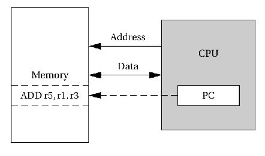
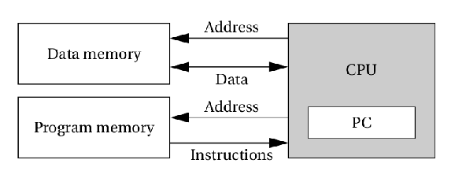
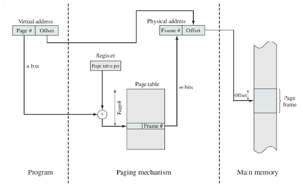
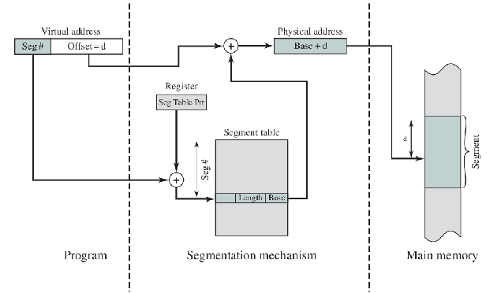

# ECE 455 - Embedded Computing

**What is an embedded system?**

* "A system of hardware and software built for a specific purpose"

* Vs. a general-purpose computer
  * Not built for a specific purpose
* Vs. a hardware only solution
  * No software, nothing to be "embedded"

## Computer Architecture

**Von Neumann Architecture**

* More efficient use of available memory

**Harvard Architecture**

* Parallelization of memory and data access
* Protection from code injection
* Harder to write self-modifying programs
  * Probably a good thing

## Registers

* **Program Counter** (PC)

* **Stack Pointer** (SP)
  * Points to "top" of stack
* **Frame Pointer** (FP)
  * Points to location of last called subroutine in stack
  * Start of local variables in current function

## Interrupts

**Overhead**

* Lookup handler in vector table
* Subroutine call
* Branch penalties
  * Pipeline flush, branch mispredictions
* Save current PC (and other state)
* Post interrupt state restoration
  * Special return instruction restores state (`refi` in ARM)

**Priority**

* Interrupt Vector Table
  * Enforces priority (NVIC in ARM)
* Non-maskable interrupts (NMI)
  * Highest Priority
  * e.g., Illegal instructions, power failure, etc.

## Paging

 ## Segmentation

