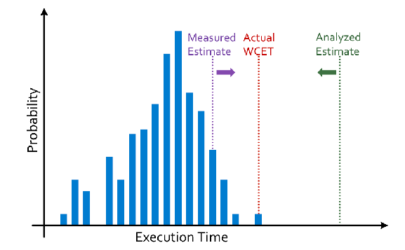
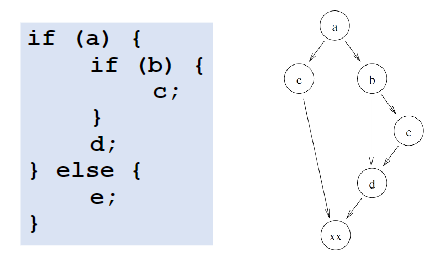

# ECE 455 - Worst-Case Execution Time (WCET)

WCET $T$ of some code $P$ with input $x$ in environment $w$ is:

$$
T = \text{max}_{x,w} \left\{ f_{P(x,w)} \right\}
$$

where $f_{P(x,w)}$ is the duration of $P$, run on $x$ in $w$.

An estimate $T'$ of WCET is:

$$
\forall \; x,w : f_{P(x,w)} \le T', \; T \le T'
$$

## Loop Bounds

* Real-time systems must have terminating loops
  * Cannot make execution guarantees without them

* Static analysis cannot find all possible loop bounds for Turing machines
  * Halting problem

* Requires very simple loops
  * Or explicit developer annotation

## Path-Based WCET Estimation

* Based on longest possible path though code
* Enumerate/explore the path space of the code
  * **Control Flow Graph**

 

A graph $G = (V,E)$ where

* $V$ are the basic blocks of the program
* $E$ indicates the flow of control between the blocks

* Obtained from source code, or machine code
  * Static Analysis
  * Dynamic Analysis

### Path Feasibility

Only care about **feasible paths**. Path-based WCET finds the longest feasible path.

### Implicit Path Enumeration (IPET)

Path-based WCET via linear programming.

* Refer to slides

## Structure Based WCET Estimation

Refer to slides.

## Compiler Interference

* Optimizations affect generated code
  * Loop unrolling

* Enable and disable optimizations individually
  * Instead of just `-O2`

## Measurement Based WCET Verification

**Use for VERIFICATION, not estimation!**

* Don't use measurement to determine WCET, not good

Methods:

* CPU clock
  * Susceptible to drift

* Processor cycle counter
  * Drift
  * Easier to compare to WCET (in cycles)

* GPIO + Oscilloscope / Logic Analyzer
  * IO Latency