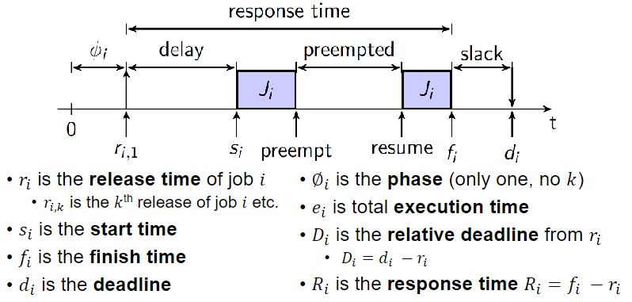
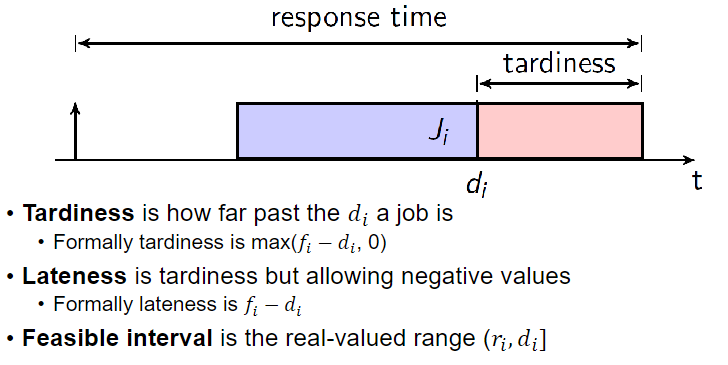
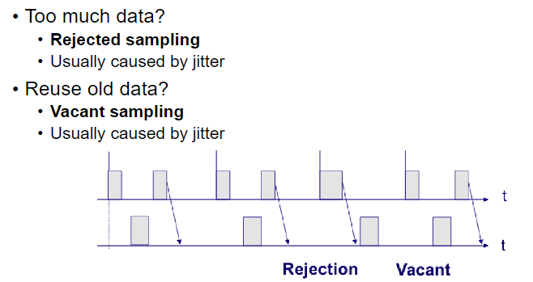

# ECE 455 - Realtime Scheduling

## Tasks and Jobs

A **task** is a distinct unit of work the system must do (a thread, in an RTOS setting).

A task is composed of **jobs**.

1. **Periodic Tasks**
   * Repeat jobs at regular intervals

2. **Sporadic Tasks**
   * Repeat jobs at some minimum inter-arrival time

3. **Aperiodic Tasks**
   * Jobs occur randomly (or not at all)

## Job Timing

## Hard vs Soft Real-Time

Formally:

* "A **hard real-time** system is a system in which tardiness must always be zero"

Practically, it is impossible to prove...

* Cosmic rays causing bitflips
* Radiation probability

Use a probability estimate instead:

* Often order of $10{-7}$ or lower

## Jitter

**Jitter** is the fluctuation in occurrences for a repeated event.

### Rejected and Vacant Sampling

## Periodic Task Model

A task $T_i$ is characterized by a pair $(P_i, e_i)$

* $P_i$ is the period
  * The task is released every $P_i$ time units
* $e_i$ is the execution time

The **hyperperiod** of a set of tasks is $H = lcm\left\lbrace P_1, ..., P_n \right\rbrace$.

## Online vs. Offline Scheduling

* **Offline**
  * Know the workload ahead of time (before runtime)

* **Online**
  * Don't know the workload ahead of time

## Scheduling Algorithms

### Simple Priority

Always run the highest priority task. If there is a tie, fall-back to first-come first-served.

### Earliest Deadline First (EDF)

Simple priority, where tasks which have earlier deadlines have higher priority.

EDF is **optimal** (i.e., it will always find a feasible schedule if one exists) if:

* Preemption is enabled and
* There is only 1 processor

To implement EDF, a priority queue is reasonable. Need to make sure that soft real-time tasks with earlier deadlines don't get priority over hard real-time tasks though.

**UB Test for EDF:**

$$
U = \sum_{k=1}^{N}{\frac{C_k}{\text{min}(D_k, \tau_k)}} \le 1
$$

where $D_k$ is the deadline for task $k$, and $\tau_k$ is the period of task $k$.

### Latest Release Time (LRT)

Simple priority, where tasks with the closest release time are scheduled first.

LRT is **optimal** if:

* Preemption is enabled and
* There is only 1 processor and
* Release time is known ahead of time
  * Offline only algorithm

### Least Slack Time (LST)

Similar to EDF. **Slack time** is the amount of time remaining before a tasks must be scheduled to meet its deadline.

* "Slack time is the amount of time remaining before the deadline of a task, minus the remaining execution time of that task"

If a task will take 10ms to execute and its deadline is 50ms away, then there is $50 - 10 = 40ms$ slack time remaining.

LST is **optimal** if:

* Preemption is enabled and
* There is only 1 processor
* (NOTE: these are the same conditions as EDF)
  * LST requires knowing the WCET of all tasks though, EDF doesn't

### Rate-Monotonic Scheduling (RMS)

Tasks with a lower periodicity get a higher priority.

RMS is **optimal** if:

* Preemption is enabled and
* There is only 1 processor and
* Tasks are *harmonic* (their periodic are integer multiples of each other)

**UB Test for RMS**

$$
U = \sum_{k=1}^{N}{\frac{C_k}{\tau_k}} \le n(2^{1/n} - 1)
$$

### Deadline-Monotonic Scheduling (DMS)

Tasks with a lower deadline get higher priority.

Same as RMS if $D_k = \tau_k$ (if deadlines of tasks are equal to their period), i.e., tasks are *simply periodic*.

## Cyclic Executive

Determine a schedule for known periodic tasks offline

* Leave spaces (slack time) for sporadic and aperiodic tasks
* Keep a queue of sporadic and aperiodic tasks at runtime

Divide offline schedule into **frames**

* Fixed length interval where running jobs are fixed
* Should evenly divide the hyperperiod of the periodic tasks

**Algorithm**

Let $t$ be the current global frame number, and $F$ be the number of frames in a hyperperiod

Timer interrupt at interfaces of frame time $f$

* Let `k = t % F`

* Check for tardiness in the last frame
  * Take appropriate action if there was tardiness (see module 4)

* Lookup schedule `L[k]` in table $L$ for frame $k$

* Execute the tasks in frame $k$

* If these slack time between periodic tasks
  * Take tasks from the sporadic/aperiodic queue
  * Set a timer, run sporadic/aperiodic task
    * If the task finishes, remove from queue
    * If timer expires, preempt, requeue, and run next periodic task
