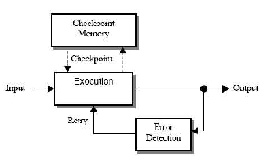
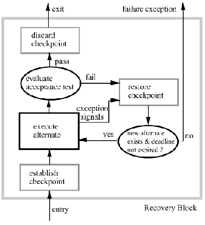
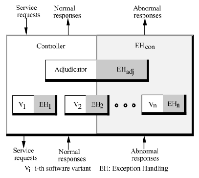
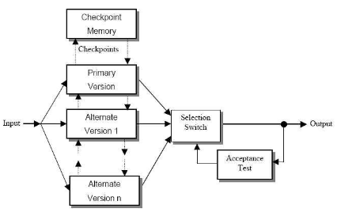
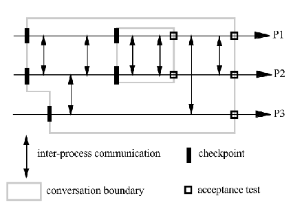
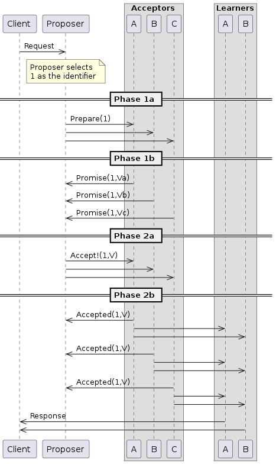

# ECE 455 - Reliability

## Fault, Error, Failure Chains

* **Failure**
  * When the delivered service no longer complies with the specification

* **Error**
  * System state that leads to a subsequent failure

* **Fault**
  * The cause of an error

```
Fault --> Error --> Failure
```

### Faults

* **Accidental** Fault vs **Intentional** Fault
  * **Accidental** - mistakes, omissions, random chance
  * **Intentional** - malicious logic

* **Permanent** Fault vs **Temporary** Fault

* **Transient** Fault vs **Intermittent** Fault
  * Types of temporary faults
  * **Transient** - originates from physical environment
  * **Intermittent** - originates internally

### Errors

Not all faults lead to failure, only if they cause an error first.

* A more **dependable** system is better at not letting faults lead to failures
* Have less possible error states from faults

### Failures

* **Value** Failure
  * Delivered service deviates from specification

* **Timing** Failure
  * Timing of a service deviates from specification

* **Resource Consumption** Failure
  * System doesn't use the correct resources per specification
    * Example: too much power consumption

## System Failure Types

* **Fail-Stop** - system stops running on failure
  * Often not feasible in the real-world

* **Fail-Silent** - system does not do anything guaranteed on failure

* **Fail-Soft** - system gracefully degrades on failure

* **Fail-Operational** - system continues operating within specified given assumptions
  * Example: aircraft

## Fault Tolerance in Embedded Systems

How to handle faults depends on where the fault comes from:

* **Interface Exception** - Failure from a lower-level component
* **Local Exception** - Something goes wrong with our computation
* **Failure Exception** - Unrecoverable fault/error that must lead to failure

Design software component to handle interface and local exceptions. Can't do anything about failure exceptions by definition.

### Recovery

* **Backward Recovery** - system returns to a checkpoint to retry
  * Time permitting

* **Forward Recovery** - system converts error state into some acceptable default then continues
  * Often due to time constraints or environment state

### Acceptance Test

An **error detector**. Must be able to detect error states from the results of component execution.

* This might not be knowable

## Basic Checkpointing



Record a checkpoint before execution begins.

* If error detector detects an error, reload state from checkpoint and try again

This is **backward recovery**.

* Simple to implement, relies on existence of error detector
* Unbounded delay
  * Can retry unlimited number of times

Not actually that effective

* Retrying the same computation is most likely just going to lead to the same error state

## Recovery Blocks



Record a checkpoint before execution begins.

* If error detector detects an error, reload checkpoint and **try another variant**
  * Another implementation of the same algorithm, that can start from the same state
  * No internal state!

This is **backward recovery**.

Relies on existence of variants

* Often, there's only one way to compute something
* Bounded delay
  * Fail after running out of variants

More effective than basic checkpointing.

## N-Version Programming

"*N-Version programming is defined as the independent generation of functionally equivalent programs from the same initial specification.*" - Algirdas A. Avizienis



Run the variants concurrently.

An **adjudicator** selects the result between the competing variants.

* Sanity checks
* Physical bounds
* State model

Variants pass state to their next iteration, even if they're not selected.

Relies on existence of adjudicator, not too difficult to implement.

This is **forward recovery** - pick a valid result if one of the variants fail.

* $n = 2$
  * If one fails, pick other result

* $n \ge 3$
  * Vote among passing results
  * Simple majority or simple plurality

### N-Version Programming (Implementation)

* Specify which units will be versioned.
* Define execution environment for units
* Define state for next units
* Define decision algorithm for adjudicator

Maximize **diversity**.

* Algorithm
* Datatypes
* Programming language (if possible)
* Compiler
* Programmer
* etc.

More diversity == more security?

* Keeps employees isolated
* Each variant passes its own state to the next iteration of itself

## Consensus Recovery Blocks

Like NVP, but the selected variant state initializes next iteration for ALL states.



Not to be confused with *consensus algorithms*, discussed later.

This is **forward recovery**.

Blocks must reach "consensus" about system state.

* Less divergence between variants
* More vulnerable to common fault

## Conversations

All processes make a checkpoint before starting a conversation.



All processes must pass their acceptance test before advancing.

* If a single process fails, all processes revert to their checkpoints and try their next variant
* Otherwise, all processes leave the conversation together

**Deserters** are processes that are tardy in a conversation.

* Since everyone must wait for all acceptance tests, now everyone misses their deadline

**Information Smuggling** is the process of information leaking from aborted conversations (I don't understand this point tbh).

* Resource consumption
* Messages external to conversation

# Consensus Algorithms

Don't confuse with consensus *recovery blocks*.

**Two Generals Problem**

* How do two generals agree to attack a city together at the same time, if they can't guarantee their messages will get through?
  * They can't
* https://www.youtube.com/watch?v=IP-rGJKSZ3s

Each member of a consensus protocol is called an **agent**. Each agent typically as a unique identifier (typically an integer).

Properties of consensus:

1. **Termination**
   * Every correct agent decides some value

2. **Agreement**
   * Every correct agent agrees on the same value

3. **Validity**
   * Only values suggested by some agent can be decided on

4. **Integrity**
   * If all the correct agents suggest the same value, each correct agent must decide on that value (often rolled into agreement)

## Paxos Consensus

https://youtu.be/s8JqcZtvnsM?si=U7NvPO430mHAqMpY

Voting based consensus algorithm.

* Majority rules
  * Consensus means that a majority of agents agree

* Can tolerate $f$ failures in a system of $2f + 1$ fail-stop agents
  * Example: 3 failures in a system of $(2\cdot3 + 1)=7$ can be tolerated, still have 4 in agreement

* $f + 1$ is a **quorum** in a system of $2f + 1$ agents
  * Example: in a system of 7 agents, 4 need to agree in order for system to proceed (need a quorum to proceed)

<br>

Three roles:

1. Proposer
2. Acceptor
3. Learners
   * If all agents are acceptors, there is no need for learners

<br>



Two phases, each with two parts:

**Phase 1** - "The Promise Stage"

* Phase 1a - **Prepare**
  * **Proposer** creates a **prepare** message with number $n$, **`Prepare(n)`**
  * $n$ must be greater than any number used in a previous prepare message from this agent
  * Proposer sends the `Prepare(n)` message to at least a quorum (majority) of agents
    * Proposer shouldn't initiate paxos if it can't communicate with at least a quorum of agents

* Phase 1b - **Promise**

  * Each **acceptor** awaits a `Prepare(n)`

  * Look at $n$

    * If $n$ is higher than every previous proposal received by the acceptor
      * Send a **`Promise(n, v)`** back
        * A promise that this acceptor will ignore all future proposals with lower $n$
        * Inform the proposer of any value $v$ it previously accepted with lower $n$ in phase 2b

    * If the acceptor has already promised to not accept $n$
      * Don't have to do anything

<br>

**Phase 2** - "The Commit Stage"
