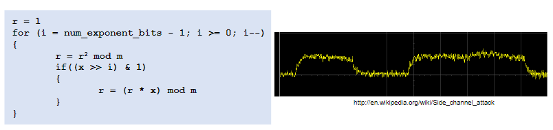

# ECE 455 - Embedded Systems Security

How is this different than general purpose computer security?

* The attacker is *physically present* with our device

Mostly C/C++/Assembly code.

* Manual memory management
* Stack management
* Simple memory model

## Hardware Solutions are Better

If your hardware can provide security, do it.

Example: webcam LED


## Buffer Overflow Attacks

Common attack on C/C++/Assembly programs.

Example: wireless door lock

```C
void read_data_from_fob(char* wireless_data)
{
    char buffer[33];

    strcpy(buffer, wireless_data);
	if ( decrypt(buffer, SECRET_KEY) == DECRYPT_OK )
    {
        unlock_door();
    }
}

void unlock_door(void)
{
    output_port( DOOR_PORT_CMD, COMMAND_BITPATTERN );
}
```

Can write out of bounds of buffer to overwrite LR on stack, can make program jump to `unlock_door()` on return from `read_data_from_fob()`.

Another variant of the attack is to write code to the buffer, then make the program jump to your malicious code.

# Cryptography

**Very** high level overview.

Principles:

1. **Confidentiality**
   * Can someone else other than the intended recipient read the data?

2. **Authenticity**
   * Is the person sending/receiving the data who they say they are?

3. **Integrity**
   * Is the data I'm receiving the data that was actually sent to me?

<br>

**Types of Cryptography**

* **Symmetric Key** Cryptography
  * Both parties share a secret

* **Asymmetric Key** Cryptography
  * Parties do not share the same secret
  * Also called **public key cryptography**
    * (Apparently, not formally, but in practice yes? This is what prof said.)

## Symmetric Key Cryptography

Sender an recipient have some pre-shared secret key $K$.

* Provides **confidentiality**.

<br>

Example (bad):

* To encrypt some $X$, calculate $C = X + K$
  * $X$ is the plaintext
  * $C$ is the ciphertext
  * $K$ is the key
* Addition is really bad for several reasons
  * Once you guess one letter, you know K and therefore all letters

<br>

Example (better):

* To encrypt plaintext $X$, calculate $C_i = X_i \oplus K_i$
  * ($\oplus$ is XOR)
  * Then move onto the next key $K_{i+1}$ for the next number $X_{i+1}$

* Very effective (theoretically unbreakable)

* Requires K just as long as X
  * Infeasible for all but the simplest cases

* This is called a **one-time pad**

<br>

In practice, just use a modern symmetric key algorithm like **AES** (Advanced Encryption Standard).

* Many modern MCUs have AES accelerators

### Problems with Symmetric Key

Have to share the key!

Somehow pre-arrange the transfer:

* Isn't a huge barrier is embedded systems, program the key into NVM at the factory
* Better keep the key *very* safe though...
  * Maybe in a **Hardware Security Module** (HSM)

## Public Key Cryptography

Use two different keys instead.

* One to encrypt (public key)
* One to decrypt (private key)

<br>

Two keys are related.

* What is encrypted by the public key can only be decrypted by the private key
  * It must be computationally infeasible to determine the decryption key from the encryption key (other way is fine though)

<br>

Everyone shares their public keys around.

* I know that if I encrypt something with your public key, you are the only person that can decrypt it, since you are the only one with your private key
  * Provides **confidentiality** in one direction

* Still vulnerable to man-in-the-middle attacks though
  * https://en.wikipedia.org/wiki/Man-in-the-middle_attack

<br>

Two main categories:

1. **Diffie-Hellman** Based
   
   * Actually a secret exchange algorithm, but formed the basis for many public key algorithms
   * Relies on the difficulty of the **discrete logarithm problem**
     * Given:
       * Base $g$
       * Modulus $m$
       * $y$ where $y = g^x \text{ mod } m$
       * Determine $x$
       * Example: for $93 = 17^x \text{ mod } 100$ solve for $x$
       * Can use **square and multiply** algorithm if we know $x$ to calculate $g^x \text{ mod } m$
       * ```
         asdf
         ```

<br>

2. Rivest-Shamir-Adleman (**RSA**) Based
	* Relies on the difficulty of factoring extremely large integers

<br>

### Digital Signatures

Sign some string with your private key

* Anyone with your public key can verify that only you could have signed that document

* Provides **authenticity**
  * Only someone with the corresponding private key could have sent me this data

* Provides **integrity**
  * The signature is only valid for that string
  * If the string is tampered with, the signature won't match

### Public Key Infrastructure

The string we sign could be *someone else's public key*.

* By signing their key I am vouching for them
* We can chain keys together this way to get a web of trust
* Give signatures a time limit, and revoke trust as necessary

# Side-Channel Analysis

Can bypass the "mathematical" security entirely if the attacker physically has the hardware (device).

* Observe the "byproducts" of computation
  * e.g., power consumption, time delays, sound, heat, etc.

## Timing Attacks

Consider the following (bad) password validation:

```C
bool is_password_ok(char* username, char* password)
{
    char* actual_password = get_password_from_db(username);

    return strcmp(actual_password, password);
}
```

The execution time of the password validation depends on how long the password is!

* `strcmp()` is $O(n)$

Can exploit this with unlimited login attempts.

* Start with a 1-character password
  * Brute force all possible 1-character passwords, the correct character means `strcmp` will take slightly longer
  * Let's say the correct character is `a`
* Now repeat for 2-character passwords
  * `aa`, `ab`, `ac`, etc.
* Continue until you have the whole password

How to fix:

* Length checks don't work, just send a password of each length until it takes longer
* **Solution:**
  * Hash passwords first, compare fixed length of hash

## Power Side-Channel Analysis

Look at the power consumption of the device while its doing certain operations.

How to obtain a power trace?

* Shunt resistor current sensor


Power consumption of CPU directly reveals information.

* Perhaps the power trace is:
  * Higher amplitude for a 1 than a 0
  * Longer periods of high voltage for a 1 than a 0


